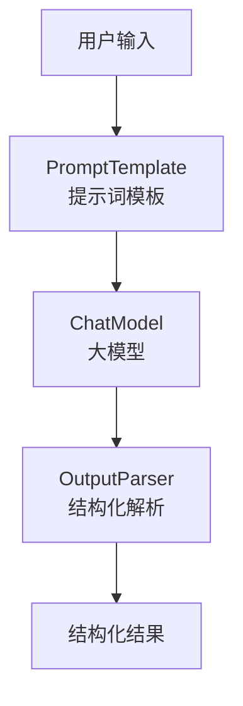

# LangChain 学习
## LangChain 概述
LangChain 提供了预构建的智能体架构和模型集成，帮助我们快速上手，无缝地将大语言模型融入智能体和应用中。
如果您希望快速构建智能体和自主应用，我们建议您使用LangChain。当您有更高级的需求，需要结合确定性工作流与智能体工作流、进行深度定制并严格控制延迟时，请使用LangGraph——我们的低级智能体编排框架和运行时。

LangChain代理构建于LangGraph之上，以提供持久执行、流式处理、人机协同、持久化等功能。您无需了解LangGraph，即可轻松使用基本的LangChain代理。

## Langchain 安装
```bash
pip install -q langchain
```

## LangChain 基础智能体实现

```
from langchain.agents import create_agent

def get_weather(city: str) -> str:
    """Get weather for a given city."""
    return f"It's always sunny in {city}!"

agent = create_agent(
    model="claude-sonnet-4-5-20250929",
    tools=[get_weather],
    system_prompt="You are a helpful assistant",
)

# Run the agent
agent.invoke(
    {"messages": [{"role": "user", "content": "what is the weather in sf"}]}
)
```

上面的方式需要本地部署好大模型，或者用 Claude (Anthropic)的API KEY账号， 并设置ANTHROPIC_API_KEY环境变量。因条件原因，上面代码不能运行。

## LangChain 智能体实现（OpenAI）

```
# 1. 导入必要的模块
from langchain_openai import ChatOpenAI
from langchain.agents import create_agent


# 2. 将函数定义为 LangChain 的 Tool
def get_weather(city: str) -> str:
    """Get the current weather in a given city."""
    # 这里是模拟，真实应用中应接入天气API
    return f"The weather in {city} is sunny and 72°F."

# 3. 以 OpenAI 兼容模式初始化聊天模型
# 关键：通过指定 base_url 来兼容不同服务商
llm = ChatOpenAI(
    model="deepseek-chat",  # 替换为豆包的模型名，如 "Doubao-lite-32k"
    openai_api_key="{your key}",  # 替换为你的API密钥
    base_url="https://api.deepseek.com/v1",  # 替换为豆包的API端点
    temperature=0
)

# 4. 定义智能体的系统提示词
system_prompt = "You are a helpful assistant that can provide weather information."

# 5. 创建智能体
agent = create_agent(
    model=llm,
    tools=[get_weather],
    system_prompt=system_prompt
)

# 6. 执行查询
result = agent.invoke(
    {"messages": [{"role": "user", "content": "What is the weather in San Francisco?"}]}
)

print(result)
```

注意： 密钥不要放到代码中，应该从环境变量中获取。 如果用conda管理环境，可以在当前环境下设置环境变量.

```
conda env config vars set OPENAI_API_KEY={your key}
```

设置完成后，必须先停用再重新激活环境，变量才会加载：
```
conda deactivate
conda activate {your env}
```

### 火山引擎Doubao模型接入关键代码

```
llm_doubao = ChatOpenAI(
    model="doubao-1-5-pro-32k-250115",  # 替换为豆包的模型名，如 "Doubao-lite-32k"
    openai_api_key=os.environ["ARK_OPENAI_API_KEY"],  # 替换为你的API密钥
    base_url="https://ark.cn-beijing.volces.com/api/v3",  # 替换为火山引擎的API端点
    temperature=0
)

system_prompt = "You are a helpful assistant that can provide weather information."

agent_doubao = create_agent(
    model=llm_doubao,
    tools=[get_weather],
    system_prompt=system_prompt
)

result_doubao = agent_doubao.invoke(
    {"messages": [{"role": "user", "content": "What is the weather in San Francisco?"}]}
)
print(result_doubao)
```

## 创建一个真实世界的智能体
构建一个实用的天气预报代理，以展示关键的生产概念：

1. 细化系统提示以改善智能体行为
2. 创建可与外部数据集成的工具
3. 模型配置以实现一致的回复
4. 结构化输出以获得可预测的结果
5. 对话记忆用于聊天式交互
6. 创建并运行智能体创建一个功能完备的智能体

### 定义系统提示词
系统提示词定义智能体的角色和行为，保持具体且可操作：
```
SYSTEM_PROMPT = """You are an expert weather forecaster, who speaks in puns.

You have access to two tools:

- get_weather_for_location: use this to get the weather for a specific location
- get_user_location: use this to get the user's location

If a user asks you for the weather, make sure you know the location. If you can tell from the question that they mean wherever they are, use the get_user_location tool to find their location."""
```

### 创建工具
工具可以让模型通过我们定义的函数调用的方式与外部系统交互，工具也可以依赖运行时和智能体记忆。

```
from dataclasses import dataclass
from langchain.tools import tool, ToolRuntime

@tool
def get_weather_for_location(city: str) -> str:
    """Get weather for a given city."""
    return f"It's always sunny in {city}!"

@dataclass
class Context:
    """Custom runtime context schema."""
    user_id: str

@tool
def get_user_location(runtime: ToolRuntime[Context]) -> str:
    """Retrieve user information based on user ID."""
    user_id = runtime.context.user_id
    return "Florida" if user_id == "1" else "SF"
```

* 配置模型

根据下面的代码，配置模型参数，改成自己的参数：

```
from langchain.chat_models import init_chat_model

model = init_chat_model(
    "claude-sonnet-4-5-20250929",
    temperature=0.5,
    timeout=10,
    max_tokens=1000
)
```

* 定义回复格式
我们可以通过定义结构化的回复格式，来确保智能体的回复符合我们的预期。

```
from dataclasses import dataclass

# We use a dataclass here, but Pydantic models are also supported.
@dataclass
class ResponseFormat:
    """Response schema for the agent."""
    # A punny response (always required)
    punny_response: str
    # Any interesting information about the weather if available
    weather_conditions: str | None = None
```

* 添加记忆
为了维护与智能体交互工程中的状态，我们可以添加对话记忆，这样智能体就能记住之前的对话和上下文。

```
from langgraph.checkpoint.memory import InMemorySaver

checkpointer = InMemorySaver()
```

* 创建并运行智能体

将所有组件组装到智能体中，并运行。

```
from langchain.agents.structured_output import ToolStrategy

agent = create_agent(
    model=model,
    system_prompt=SYSTEM_PROMPT,
    tools=[get_user_location, get_weather_for_location],
    context_schema=Context,
    response_format=ToolStrategy(ResponseFormat),
    checkpointer=checkpointer
)

# `thread_id` is a unique identifier for a given conversation.
config = {"configurable": {"thread_id": "1"}}

response = agent.invoke(
    {"messages": [{"role": "user", "content": "what is the weather outside?"}]},
    config=config,
    context=Context(user_id="1")
)

print(response['structured_response'])
# ResponseFormat(
#     punny_response="Florida is still having a 'sun-derful' day! The sunshine is playing 'ray-dio' hits all day long! I'd say it's the perfect weather for some 'solar-bration'! If you were hoping for rain, I'm afraid that idea is all 'washed up' - the forecast remains 'clear-ly' brilliant!",
#     weather_conditions="It's always sunny in Florida!"
# )


# Note that we can continue the conversation using the same `thread_id`.
response = agent.invoke(
    {"messages": [{"role": "user", "content": "thank you!"}]},
    config=config,
    context=Context(user_id="1")
)

print(response['structured_response'])
# ResponseFormat(
#     punny_response="You're 'thund-erfully' welcome! It's always a 'breeze' to help you stay 'current' with the weather. I'm just 'cloud'-ing around waiting to 'shower' you with more forecasts whenever you need them. Have a 'sun-sational' day in the Florida sunshine!",
#     weather_conditions=None
# )
```

## LangChain 中的“链”
链式调用位于LangChain三层核心架构中的中间层——工作流API抽象层。Chain翻译成中文就是“链”，我们将大模型、相关工具等作为组件，链就是负责将这些组件按照某一种逻辑，顺序组合成一个流水线的方式。比如我们要构建一个简单的问答链，就需要把大模型组件和标准输出组件用链串联起来。

### LangChain 链代码实现
1. 简单链

搭建一个简单链，将模型“输出结果”过滤为一个纯字符串格式:

```
from langchain.chat_models import init_chat_model
from langchain_core.output_parsers import StrOutputParser # 导入标准输出组件

model = init_chat_model(
    model="doubao-1-5-pro-32k-250115",
    model_provider="openai",
    base_url="https://ark.cn-beijing.volces.com/api/v3",
    api_key=os.environ["ARK_OPENAI_API_KEY"], #你注册的火山引擎api_key
)

# 搭建链条，把model和字符串输出解析器组件连接在一起
basic_qa_chain = model | StrOutputParser()

# 查看输出结果
question = "你好，请你介绍一下你自己。"
result = basic_qa_chain.invoke(question)

print(result)

```

运行上面的代码，可以看到此时的result不再是包含模型各种调用信息的AIMessage对象，而是纯粹的模型响应的字符串结果。


2. 提示词模板创建链
链流程增加一个提示词模板，可以借助ChatPromptTemplate非常便捷的将一个提示词模板打造为组件，同样以链的形式加入当前流程中

```
import os
from langchain.chat_models import init_chat_model
from langchain_core.prompts import ChatPromptTemplate
from langchain_core.output_parsers import StrOutputParser

model = init_chat_model(
    model="doubao-1-5-pro-32k-250115",
    model_provider="openai",
    base_url="https://ark.cn-beijing.volces.com/api/v3",
    api_key=os.environ["ARK_OPENAI_API_KEY"], #你注册的火山引擎api_key
)

prompt_template = ChatPromptTemplate([
    ("system", "你是一个乐意助人的助手，请根据用户的问题给出回答"),
    ("user", "这是用户的问题： {topic}， 请用 yes 或 no 来回答")
])

# 直接使用模型 + 输出解析器
bool_qa_chain = prompt_template | model | StrOutputParser()
# 测试
question = "请问 1 + 1 是否 大于 2？"
result = bool_qa_chain.invoke({'topic':question})
print(result)

```

借助提示词模板即可实现相应的结构化输出。


3. 结构化解析器

LangChain中一个基础的链一般由如下三部分构成，分别是提示词模板、大模型和结构化解析器。智能体开发人员通过提示词让大模型输出结构化的字符串，然后通过结构化解析器将字符串解析为指定对象。流程为:





LangChain中常用的核心结构化解析器功能如下:


| 解析器名称 | 功能描述 | 类型 |
|-----------|----------|------|
| BooleanOutputParser | 将 LLM 输出解析为布尔值 | 基础类型解析 |
| DatetimeOutputParser | 将 LLM 输出解析为日期时间 | 基础类型解析 |
| EnumOutputParser | 解析输出为预定义枚举值之一 | 基础类型解析 |
| RegexParser | 使用正则表达式解析 LLM 输出 | 模式匹配解析 |
| RegexDictParser | 使用正则表达式将输出解析为字典 | 模式匹配解析 |
| StructuredOutputParser | 将 LLM 输出解析为结构化格式 | 结构化解析 |
| YamlOutputParser | 使用 Pydantic 模型解析 YAML 输出 | 结构化解析 |
| PandasDataFrameOutputParser | 使用 Pandas DataFrame 格式解析输出 | 数据处理解析 |
| CombiningOutputParser | 将多个输出解析器组合为一个 | 组合解析器 |
| OutputFixingParser | 包装解析器并尝试修复解析错误 | 错误处理解析 |
| RetryOutputParser | 包装解析器并尝试修复解析错误 | 错误处理解析 |
| RetryWithErrorOutputParser | 包装解析器并尝试修复解析错误 | 错误处理解析 |
| ResponseSchema | 结构化输出解析器的响应模式 | 辅助类 |

4. 复杂链构造

我们以一个”从美食菜谱名称生成制作步骤，并从中提取核心食材和烹饪时长” 的案例来讲解，这个案例同样包含了“文本生成”和“结构化信息提取”两个环节。

```
import os
from langchain.chat_models import init_chat_model
from langchain_core.prompts import PromptTemplate
# 这个包在所有 0.1+ 版本中都非常稳定
from langchain_core.output_parsers import JsonOutputParser

# 1. 初始化模型
model = init_chat_model(
    model="doubao-1-5-pro-32k-250115",
    model_provider="openai",
    base_url="https://ark.cn-beijing.volces.com/api/v3",
    api_key=os.environ.get("ARK_OPENAI_API_KEY"),
)

# 2. 初始化 JsonOutputParser (不需要定义复杂的 ResponseSchema)
parser = JsonOutputParser()

# 3. 编写链
# 第一步生成文本
gen_prompt = PromptTemplate.from_template("请根据菜名编写一个简短的制作步骤, 包括制作难度与耗时：{dish_name}")
# 第二步提取并强制要求 JSON
extract_prompt = PromptTemplate.from_template(
    "从以下内容中提取信息：食材清单(ingredients)、烹饪时长(time)、难度(difficulty)。\n"
    "必须以 JSON 格式返回。\n"
    "内容：{recipe}"
)

# 4. 组合链
full_chain = (
    {"recipe": gen_prompt | model | (lambda x: x.content)}
    | extract_prompt
    | model
    | parser  # 直接解析 JSON
)

# 执行
try:
    result = full_chain.invoke({"dish_name": "地三鲜"})
    print(result)
except Exception as e:
    print(f"仍然报错: {e}")
```

### 自定义Langchain组件
Langchain 提供了开发者自定义可运行节点的功能.如果我们想在链中设置调试组件该如何编写代码?这就需要用到LangChain的Runnable组件了。 在上述复合链代码中添加:
```
from langchain_core.runnables import RunnableLambda

def debug_print(x):
    print('中间结果：', x)
    return x

debug_node = RunnableLambda(debug_print)

# 组合成一个复合 Chain
full_chain = (
    {"recipe": gen_prompt | debug_node | model | (lambda x: x.content)} | debug_node
    | extract_prompt
    | model | debug_node
    | parser  # 直接解析 JSON
)

# 调用复合链
result = full_chain.invoke({"title": "地三鲜"})
print(result)

```

运行上面的代码可以看到每一步都会有中间结果输出。


RunnableLambda将python函数转换为可运行节点。转化后的节点可以像任何其它Runnable一样组合并与LangChain链无缝集成。（特别注意: RunnableLambda适合非流式输出，如果要流式输出请使用RunnableGenerator python.langchain.com/api_referen…）。

## LCEL简述
代码中|符号被我们广泛使用，Python没有这种语法，为什么这里可以把各个组件串起来。

其实这是LangChain专门为现代大语言模型应用开发的一种全新表达范式，被称为LCEL（LangChain Expression Language） 。它不仅简化了模型交互的编排过程，还增强了组合的灵活性和可维护性。

###  LCEL的定义
LCEL，全称为LangChain Expression Language，是一种专为 LangChain 框架设计的表达语言。它通过一种链式组合的方式，允许开发者使用清晰、声明式的语法来构建语言模型驱动的应用流程。
简单来说，LCEL 是一种“函数式管道风格”的组件组合机制，用于连接各种可执行单元（Runnable）。这些单元包括提示模板、语言模型、输出解析器、工具函数等。

### LCEL的设计目的
LCEL 的设计初衷在于：

*模块化构建*：将模型调用流程拆解为独立、可重用的组件。
*逻辑可视化*：通过语法符号（如管道符 |）呈现出明确的数据流路径。
*统一运行接口*：所有 LCEL 组件都实现了 .invoke()、.stream()、.batch() 等标准方法，便于在同步、异步或批处理环境下调用。
*脱离框架限制*：相比传统的 Chain 类和 Agent 架构，LCEL 更轻量、更具表达力，减少依赖的“黑盒”逻辑。

### LCEL的核心组成
LCEL的核心组成有如下三点:

1. Runnable 接口

LCEL 的一切基础单元都是 Runnable 对象，它是一种统一的可调用接口，支持如下形式：
.invoke(input)：同步调用
.stream(input)：流式生成
.batch(inputs)：批量执行

2. 管道运算符 |
这是 LCEL 最具特色的语法符号。多个 Runnable 对象(也就是我们说的组件)可以通过 | 串联起来，形成清晰的数据处理链。例如：
```
prompt | model | parser
```

表示数据将依次传入提示模板、模型和输出解析器，最终输出结构化结果。

3. PromptTemplate 与 OutputParser
LCEL 强调组件之间的职责明确，Prompt 只负责模板化输入，Parser 只负责格式化输出，Model 只负责推理。

## LangChain记忆存储

### LangChain单轮会话

编写LangChain单轮对话的基本流程如下:

1. 导入相关依赖包并初始化提示词ChatPromptTemplate
2. 调用统一接口init_chat_model初始化大模型组件
3. 使用LCEL语法将大模型组件和输出解析器组件相连接，形成“链”
4. 执行“链”并输出结果

```
from langchain_core.output_parsers import StrOutputParser
from langchain.chat_models import init_chat_model
from langchain.prompts import ChatPromptTemplate
from langchain.chat_models import init_chat_model


chatbot_prompt = ChatPromptTemplate.from_messages([
    ("system", "你叫小智，是人工智能专家。"),
    ("user", "{input}")
])

# 使用模型
model = init_chat_model(
    model="Qwen/Qwen3-8B",
    model_provider="openai",
    base_url="",
    api_key="你注册的api key",
)

# 直接使用模型 + 输出解析器
basic_qa_chain = chatbot_prompt | model | StrOutputParser()

# 测试
question = "你好，请你介绍一下你自己。"
result = basic_qa_chain.invoke(question)
print(result)

```

### LangChain多轮记忆
要把单轮对话修改为多轮对话我们应该怎么做呢？逻辑其实很简单，在LangChain中我们可以通过人工拼接消息队列来为每次模型调用设置多轮对话记忆。需要进行如下步骤：

1. 构建提示词组件ChatPromptTemplate时，通过占位符MessagePlaceholder定义一个消息列表, 关键代码为：
```
prompt = ChatPromptTemplate.from_messages([ 
    SystemMessage(content="你叫小智，是人工智能专家。"),  
    MessagesPlaceholder(variable_name="messages"), 
])
```

2. 在多轮对话中不断的向message列表中追加消息，并将其传递给占位符，大模型组件接收到列表信息后会自动关联历史消息并回复内容, 关键代码为:

```
messages_list.append(HumanMessage(content=user_query)) 

assistant_reply = chain.invoke({"messages": messages_list}) 

print("小智：", assistant_reply)
```

完整的多轮对话代码如下:

```
import os
from langchain_core.messages import AIMessage, HumanMessage, SystemMessage
from langchain_core.prompts import ChatPromptTemplate, MessagesPlaceholder
from langchain.chat_models import init_chat_model
from langchain_core.output_parsers import StrOutputParser

# 使用 硅基流动 模型
model = init_chat_model(
    model="doubao-1-5-pro-32k-250115",
    model_provider="openai",
    base_url="https://ark.cn-beijing.volces.com/api/v3",
    api_key=os.environ.get("ARK_OPENAI_API_KEY"),
)

parser = StrOutputParser()

prompt = ChatPromptTemplate.from_messages([
    SystemMessage(content="你叫小智，是人工智能专家。"),
    MessagesPlaceholder(variable_name="messages"),
])

chain = prompt | model | parser

messages_list = []  # 初始化历史
print("🔹 输入 exit 结束对话")
while True:
    user_query = input("你：")
    if user_query.lower() in {"exit", "quit"}:
        break
    messages_list.append(HumanMessage(content=user_query))
    assistant_reply = chain.invoke({"messages": messages_list})
    print("小智：", assistant_reply)
    messages_list.append(AIMessage(content=assistant_reply))
    messages_list = messages_list[-50:]
```

### 流式打印
LangChain提供了一个stream方法，可以实现流式输出，只需要在调用模型回答时将invoke方法替换为stream即可。stream()是同步方法,使用for循环接受返回的chunk块。如果异步调用，需要使用astream(),然后使用async for异步for循环获取模型输出。

```
#  调用模型
assistant_reply=''
print('小智:', end=' ')
for chunk in chain.stream({"messages": messages_list}):
    assistant_reply+=chunk
    print(chunk, end="", flush=True)
print()

# 追加 AI 回复
messages_list.append(AIMessage(content=assistant_reply))

```


## Langchain 接入工具基本流程
### LangChain接入内置工具
LangChain生态从建立起就内置集成了非常多的实用工具，开发者可以快速调用这些工具完成更加复杂工作流的开发。可访问官方文档[Tools and toolkits](https://docs.langchain.com/oss/python/integrations/tools)查看LangChain内置工具列表。LangChain内置工具可分为Search在线搜索工具、Code Interpreter代码解释器工具、Productivit自动化工具、WebBrowsing浏览器自动化工具、Database数据库工具等多种类别。

接下来的例子使用SQLDatabase Toolkit接入数据库工具。

SQLDatabaseToolkit 中的工具旨在与 SQL 数据库进行交互。
一个常见的应用场景是使智能体能够利用关系型数据库中的数据来回答问题，甚至可能以迭代的方式进行数据查询和分析。

### 设置
要启用单个工具的自动追踪功能，设置LangSmith API 密钥：
```
os.environ["LANGSMITH_API_KEY"] = getpass.getpass("Enter your LangSmith API key: ")
os.environ["LANGSMITH_TRACING"] = "true"
```

### 安装
工具在langchain-community包里，需要安装:
```
pip install -qU  langchain-community
```
以及安装其他必要的依赖项，例如SQLAlchemy：
```
pip install -qU sqlalchemy requests
```

下面我们将使用 requests 库拉取 .sql 文件并创建一个内存中的 SQLite 数据库。请注意，这种方法虽然轻量级，但具有临时性且不是线程安全的。也可以按照说明将文件本地保存为 Chinook.db，并通过 db = SQLDatabase.from_uri("sqlite:///Chinook.db") 实例化数据库。

```
import sqlite3

import requests
from langchain_community.utilities.sql_database import SQLDatabase
from sqlalchemy import create_engine
from sqlalchemy.pool import StaticPool


def get_engine_for_chinook_db():
    """Pull sql file, populate in-memory database, and create engine."""
    url = "https://raw.githubusercontent.com/lerocha/chinook-database/master/ChinookDatabase/DataSources/Chinook_Sqlite.sql"
    response = requests.get(url)
    sql_script = response.text

    connection = sqlite3.connect(":memory:", check_same_thread=False)
    connection.executescript(sql_script)
    return create_engine(
        "sqlite://",
        creator=lambda: connection,
        poolclass=StaticPool,
        connect_args={"check_same_thread": False},
    )


engine = get_engine_for_chinook_db()

db = SQLDatabase(engine)
```

创建一个大模型示例：
```
llm = init_chat_model(
    model="doubao-1-5-pro-32k-250115",
    model_provider="openai",
    base_url="https://ark.cn-beijing.volces.com/api/v3",
    api_key=os.environ.get("ARK_OPENAI_API_KEY"),
)
```

实例化一个工具集:
```
from langchain_community.agent_toolkits.sql.toolkit import SQLDatabaseToolkit

toolkit = SQLDatabaseToolkit(db=db, llm=llm)
```

### 在智能体中使用工具集
接下来我们为一个简单的问答代理配备我们工具包中的工具。首先，我们获取一个相关的提示词并用其所需参数填充它：
```
from langchain_classic import hub

prompt_template = hub.pull("langchain-ai/sql-agent-system-prompt")

assert len(prompt_template.messages) == 1
print(prompt_template.input_variables)

system_message = prompt_template.format(dialect="SQLite", top_k=5)
```

实例化一个智能体：
```
from langchain.agents import create_agent

agent = create_agent(llm, toolkit.get_tools(), system_prompt=system_message)
```

最后，进行查询：
```
example_query = "Which country's customers spent the most?"

events = agent.stream(
    {"messages": [("user", example_query)]},
    stream_mode="values",
)
for event in events:
    event["messages"][-1].pretty_print()
```

输出内容如下：

```
...
================================== Ai Message ==================================

The top 5 countries whose customers spent the most are as follows:
| Country | TotalSpent |
| ---- | ---- |
| USA | 523.06 |
| Canada | 303.96 |
| France | 195.1 |
| Brazil | 190.1 |
| Germany | 156.48 |

So, the customers from the USA spent the most.
```

### Langchain接入自定义工具

除了使用LangChain的内部工具，我们还可以自行创建外部函数并将其封装为一个LangChain"链"可调用的tool组件。实现一个获取天气的智能体工具，具体的步骤如下：

1. 心知天气注册及API key获取

打开心知天气的[官网](https://www.seniverse.com/console)，注册登录并点击控制台:

创建好密钥之后可以在后续使用。

2. 编写验证API key代码 
利用python requests库调用API获得天气情况（免费版的只能得到天气现象、天气现象代码和气温 3项数据）
```
import requests

url = "https://api.seniverse.com/v3/weather/now.json"

params = {
    "key": "",  # 填写你的私钥
    "location": "北京",  # 你要查询的地区可以用代号，拼音或者汉字，文档在官方下载，这里举例北京
    "language": "zh-Hans",  # 中文简体
    "unit": "c",  # 获取气温
}

response = requests.get(url, params=params)  # 发送get请求
temperature = response.json()  # 接受消息中的json部分
print(temperature['results'][0]['now'])  # 输出接收到的消息进行查看

```

3. 为了让大模型能够调用天气工具，需要将调用天气API封装成函数.

```
import requests

def get_weather(loc):
    url = "https://api.seniverse.com/v3/weather/now.json"
    params = {
        "key": "", #填写你的私钥
        "location": loc,
        "language": "zh-Hans",
        "unit": "c",
    }
    response = requests.get(url, params=params)
    temperature = response.json()
    return temperature['results'][0]['now']

```

4.  让大模型理解函数, 构造Fuction Call
准备好外部函数之后，非常重要的一步是将外部函数的信息以某种形式传输给大模型，让大模型理解函数的作用。大模型需要特定的字典格式对函数进行完整描述, 字典描述包括:
- name:函数名称字符串
- description: 描述函数功能的字符串，大模型选择函数的核心依据
- parameters: 函数参数, 要求遵照JSON Schema格式输入，JSON Schema格式请参照[JSON Schema格式详解](https://json-schema.apifox.cn/)

```
get_weather_function = {
    'name': 'get_weather',
    'description': '查询即时天气函数，根据输入的城市名称，查询对应城市的实时天气',
    'parameters': {
        'type': 'object',
        'properties': { #参数说明
            'loc': {
                'description': '城市名称',
                'type': 'string'
            }
        },
        'required': ['loc']  #必备参数
    }
}
```

完成对get_weather函数描述后，还需要将其加入tools列表，用于告知大模型可以使用哪些函数以及这些函数对应的描述，并在可用函数对象中记录一下：
```
tools = [    
    {
        "type": "function",
        "function":get_weather_function
    }
]
available_functions = {
    'get_weather': get_weather
}
```

5. 大模型调用Function Call
接下来用大模型调用Function Call, 这里用的大模型是doubao-1-5-pro-32k。

构造大模型：
```
llm = init_chat_model(
    model="doubao-1-5-pro-32k-250115",
    model_provider="openai",
    base_url="https://ark.cn-beijing.volces.com/api/v3",
    api_key=os.environ.get("ARK_OPENAI_API_KEY"),
)
```

先试下不用Function Call, 让大模型查询天气的结果.

```
basic_qa_chain = model | StrOutputParser()
question = "请帮我查询北京地区今日天气情况"
result = basic_qa_chain.invoke(question)

print(result)
```

大模型给出的输出如下：

```
我没办法直接获取实时的北京地区今日天气情况。不过你可以通过以下几种方式查询：

天气类应用程序
**彩云天气**：能提供精准的天气信息，包括逐小时预报、降水预报等，还会有天气雷达图展示降水动态。
**墨迹天气**：除了基本的天气状况、温度、湿度等信息，还有生活指数，如穿衣指数、洗车指数等，方便安排日常生活。
**中国天气通**：由中国气象局官方推出，数据权威可靠，有详细的气象预警信息。
```

可以看到，没有Function Call 功能，大模型是查询到实时天气的。

将函数相关信息输入给大模型，需要额外设置两个参数，首先是tools参数, 用于申明外部函数库, 也就是我们上面定义的tools列表对象。其次是可选参数tool_choice参数，该参数用于控制模型对函数的选取，默认值为auto, 表示会根据用户提问自动选择要执行函数，若想让模型在本次执行特定函数不要自行挑选，需要给tool_choice参数赋予{"name":"functionname"}值，这时大模型就会从tools列表中选取函数名为functionname的函数执行。这里让模型自动挑选函数来执行:
```
basic_qa_chain = model
question = "请帮我查询北京地区今日天气情况"
result = basic_qa_chain.invoke(question, tools=tools, tool_choice="auto")

print(result)
```

执行上面的代码, 输出如下：

```
content='用户需要查询北京地区今日天气情况，调用 get_weather 函数获取信息。' additional_kwargs={'refusal': None} response_metadata={'token_usage': {'completion_tokens': 69, 'prompt_tokens': 79, 'total_tokens': 148, 'completion_tokens_details': {'accepted_prediction_tokens': None, 'audio_tokens': None, 'reasoning_tokens': 0, 'rejected_prediction_tokens': None}, 'prompt_tokens_details': {'audio_tokens': None, 'cached_tokens': 0}}, 'model_provider': 'openai', 'model_name': 'doubao-1-5-pro-32k-250115', 'system_fingerprint': None, 'id': '021766661440617e598b1e7ef00194e20b378e3561cb7f3f2d394', 'service_tier': 'default', 'finish_reason': 'tool_calls', 'logprobs': None} id='lc_run--019b553a-43ee-76a1-9039-e51c3b831cc9-0' tool_calls=[{'name': 'get_weather', 'args': {'loc': '北京'}, 'id': 'call_jfncxiw8wf21j5h4jycfrolw', 'type': 'tool_call'}] usage_metadata={'input_tokens': 79, 'output_tokens': 69, 'total_tokens': 148, 'input_token_details': {'cache_read': 0}, 'output_token_details': {'reasoning': 0}}
```

可以看到，大模型输出了一个函数调用指令，调用了get_weather函数，参数为loc=北京。


意大模型不会帮我们自动调用函数，它只会帮我们选择要调用的函数以及生成函数参数， 下一步将大模型生成的函数参数输入大模型选择的函数并执行。通过上面定义的available_functions对象找到具体的函数，并将大模型返回的参数传入（这里 ** 是一种便捷的参数传递方法，该方法会将字典中的每个key对应的value传输到同名参数位中）,可以看到天气函数成功执行:

```
# 获取函数名称
function_name = result.tool_calls[0].function.name

# 获得对应函数对象
function_to_call = available_functions[function_name]

# 获得执行函数所需参数
function_args = json.loads(result.tool_calls[0].function.arguments)

# 执行函数
function_response = function_to_call(**function_args)

print(function_response)
```

输出如下内容：
```
{'text': '晴', 'code': '1', 'temperature': '-1'}
```
上面的输出结果也就是知心天气查询结果，text为晴，code为1，temperature为-1摄氏度。

在调用天气函数得到天气情况后，将天气结果传入mesages列表中并发送给大模型，让大模型理解上下文。函数执行结果的message是tool_message类型。

将大模型关于选择函数的回复response_message内容解析后传入messages列表中。

```
print(response_message.model_dump())
messages.append(response_message.model_dump()) 
```

上面的model_dump()输出的内容如下：
```
{
	'content': '',
	'refusal': None,
	'role': 'assistant',
	'annotations': None,
	'audio': None,
	'function_call': None,
	'tool_calls': [{
		'id': 'call_0_8feaa367-c274-4c84-830f-13b49358a231',
		'function': {
			'arguments': '{"loc":"北京"}',
			'name': 'get_weather'
		},
		'type': 'function',
		'index': 0
	}]
}
```

再将函数执行结果作为tool_message并与response_message关联后传入messages列表中:

```
messages.append({
    "role": "tool",
    "content": json.dumps(function_response), # 将回复的字典转化为json字符串
    "tool_call_id": response_message.tool_calls[0].id # 将函数执行结果作为tool_message添加到messages中, 并关联返回执行函数内容的id
})
```

接下来，再次调用大模型来围绕messages进行回答。需要注意的是，此时不再需要向模型重复提问，只需要简单的将我们已经准备好的messages 传给大模型。

```
second_response = model.invoke(messages)
print(second_response.content)
```

下面看大模型的输出结果，很明显大模型接收到了函数执行的结果，并进一步处理得到输出，同时天气和气温的输出也是正确的。

也可以写一个代码，将上面的流程串起来，这样使用起来就简单了。下面是完整的代码：

```
import os
import requests
import json
from langchain.chat_models import init_chat_model
from langchain_core.output_parsers import StrOutputParser

# 初始化模型（使用豆包模型）
model = init_chat_model(
    model="doubao-1-5-pro-32k-250115",
    model_provider="openai",
    base_url="https://ark.cn-beijing.volces.com/api/v3",
    api_key=os.environ["ARK_OPENAI_API_KEY"],
)

# 查询天气函数
def get_weather(loc):
    """查询即时天气函数，根据输入的城市名称，查询对应城市的实时天气"""
    url = "https://api.seniverse.com/v3/weather/now.json"
    params = {
        "key": os.environ["XINZHI_API_KEY"],  # 填写你的私钥
        "location": loc,
        "language": "zh-Hans",
        "unit": "c",
    }
    response = requests.get(url, params=params)
    temperature = response.json()
    return temperature['results'][0]['now']

# 另一个示例函数：获取城市信息
def get_city_info(city):
    """获取城市基本信息"""
    # 这里可以接入其他API，比如获取城市人口、面积等信息
    city_data = {
        "北京": {"population": "2154万", "area": "16410平方公里", "description": "中华人民共和国的首都"},
        "上海": {"population": "2489万", "area": "6341平方公里", "description": "中国的经济中心城市"},
        "广州": {"population": "1530万", "area": "7434平方公里", "description": "广东省省会，重要的港口城市"},
    }
    return city_data.get(city, {"error": "未找到该城市信息"})

def run_conv(messages, 
             api_key, 
             tools=None, 
             functions_list=None, 
             model_name="doubao-1-5-pro-32k-250115",
             max_tool_calls=5):
    """
    通用的对话函数，支持工具调用（增强版，支持多次调用）
    
    Args:
        messages: 对话消息列表
        api_key: API密钥
        tools: 工具列表（可选）
        functions_list: 可用函数列表（可选）
        model_name: 模型名称
        max_tool_calls: 最大工具调用次数，防止无限循环
    
    Returns:
        str: 最终响应内容
    """
    # 设置环境变量以确保API key正确
    import os
    original_api_key = os.environ.get("ARK_OPENAI_API_KEY")
    os.environ["ARK_OPENAI_API_KEY"] = api_key
    
    try:
        # 使用现有的全局模型实例
        user_messages = messages.copy()
        
        # 如果没有外部函数库，则执行普通的对话任务
        if tools is None:
            response = model.invoke(user_messages)
            final_response = response.content
        
        # 若存在外部函数库，支持多次工具调用
        else:
            # 创建外部函数库字典
            available_functions = {func.__name__: func for func in functions_list}
            
            # 循环处理工具调用
            tool_call_count = 0
            
            while tool_call_count < max_tool_calls:
                # 调用模型
                response = model.invoke(
                    user_messages, 
                    tools=tools, 
                    tool_choice="auto"
                )
                response_message = response
                
                # 检查是否有工具调用
                if hasattr(response_message, 'tool_calls') and response_message.tool_calls:
                    # 处理所有工具调用
                    for tool_call in response_message.tool_calls:
                        # 获取函数名和参数
                        function_name = tool_call["name"]
                        function_args = tool_call["args"]
                        tool_call_id = tool_call["id"]
                        
                        # 检查函数是否存在
                        if function_name in available_functions:
                            function_to_call = available_functions[function_name]
                            
                            # 执行函数
                            try:
                                function_response = function_to_call(**function_args)
                                
                                # 将模型响应和工具响应添加到消息历史
                                user_messages.append(response_message.model_dump())
                                user_messages.append({
                                    "role": "tool",
                                    "content": json.dumps(function_response, ensure_ascii=False),
                                    "tool_call_id": tool_call_id
                                })
                                
                            except Exception as e:
                                print(f"函数执行出错: {e}")
                                # 添加错误信息到消息历史
                                user_messages.append(response_message.model_dump())
                                user_messages.append({
                                    "role": "tool",
                                    "content": json.dumps({"error": str(e)}),
                                    "tool_call_id": tool_call_id
                                })
                        else:
                            print(f"未找到函数: {function_name}")
                    
                    tool_call_count += 1
                    
                else:
                    # 模型未选择工具调用，结束循环
                    break
            
            # 获取最终响应
            if user_messages:
                final_response = response_message.content
            else:
                final_response = "未能获得有效响应"
        
        return final_response
    
    finally:
        # 恢复原来的API key
        if original_api_key is not None:
            os.environ["ARK_OPENAI_API_KEY"] = original_api_key

# 定义工具
get_weather_function = {
    'name': 'get_weather',
    'description': '查询即时天气函数，根据输入的城市名称，查询对应城市的实时天气',
    'parameters': {
        'type': 'object',
        'properties': {  # 参数说明
            'loc': {
                'description': '城市名称',
                'type': 'string'
            }
        },
        'required': ['loc']  # 必备参数
    }
}

get_city_info_function = {
    'name': 'get_city_info',
    'description': '获取城市基本信息，包括人口、面积和描述',
    'parameters': {
        'type': 'object',
        'properties': {
            'city': {
                'description': '城市名称',
                'type': 'string'
            }
        },
        'required': ['city']
    }
}

tools = [
    {
        "type": "function",
        "function": get_weather_function
    },
    {
        "type": "function", 
        "function": get_city_info_function
    }
]

# 测试代码
if __name__ == "__main__":
    # 设置API密钥
    ds_api_key = os.environ["ARK_OPENAI_API_KEY"]
    
    # 测试1：普通对话（无工具）
    print("=== 测试1：普通对话 ===")
    messages1 = [{"role": "user", "content": "请介绍一下人工智能的发展历史"}]
    response1 = run_conv(messages=messages1, api_key=ds_api_key)
    print(f"AI回答：{response1}")
    print()
    
    # 测试2：工具调用（天气查询）
    print("=== 测试2：天气查询 ===")
    messages2 = [{"role": "user", "content": "请问上海今天天气如何？"}]
    response2 = run_conv(messages=messages2, 
                        api_key=ds_api_key,
                        tools=tools, 
                        functions_list=[get_weather, get_city_info])
    print(f"AI回答：{response2}")
    print()
    
    # 测试3：工具调用（城市信息）
    print("=== 测试3：城市信息查询 ===")
    messages3 = [{"role": "user", "content": "请告诉我北京的基本信息"}]
    response3 = run_conv(messages=messages3,
                        api_key=ds_api_key, 
                        tools=tools,
                        functions_list=[get_weather, get_city_info])
    print(f"AI回答：{response3}")
    print()
    
    # 测试4：复合问题（需要多个工具）
    print("=== 测试4：复合问题（多次工具调用） ===")
    messages4 = [{"role": "user", "content": "我想了解广州的天气和基本信息"}]
    print(f"问题: {messages4[0]['content']}")
    print("开始处理...")
    
    response4 = run_conv(messages=messages4,
                        api_key=ds_api_key,
                        tools=tools, 
                        functions_list=[get_weather, get_city_info],
                        max_tool_calls=5)
    
    print(f"AI回答：{response4}")
    print("=" * 50)
```


其实可以不用上面的方式这么复杂，可以直接用create_agent函数实现，详细代码见chain9.py。

```
import requests
import os

from langchain.agents import create_agent
from langchain.tools import tool
from langchain_core.prompts import ChatPromptTemplate
from langchain.chat_models import init_chat_model


@tool
def get_weather(loc: str):
    """查询即时天气函数，根据输入的城市名称，查询对应城市的实时天气"""
    url = "https://api.seniverse.com/v3/weather/now.json"
    params = {
        "key": os.environ["XINZHI_API_KEY"],
        "location": loc,
        "language": "zh-Hans",
        "unit": "c",
    }
    response = requests.get(url, params=params)
    data = response.json()
    return data["results"][0]["now"]


prompt = ChatPromptTemplate.from_messages(
    [
        ("system", "你是天气助手，请根据用户的问题，给出相应的天气信息"),
        ("human", "{input}"),
        ("placeholder", "{agent_scratchpad}"),
    ]
)

# Doubao / 火山模型
model = init_chat_model(
    model="doubao-1-5-pro-32k-250115",
    model_provider="openai",
    base_url="https://ark.cn-beijing.volces.com/api/v3",
    api_key=os.environ["ARK_OPENAI_API_KEY"],
)

# 创建 agent
agent = create_agent(
    model=model,
    tools=[get_weather],
    system_prompt="你是天气助手，请根据用户的问题，给出相应的天气信息",
)


# 调用
result = agent.invoke(
    {"messages": [("user", "北京的天气")]}
)


final_message = result["messages"][-1]
print(final_message.content)

```