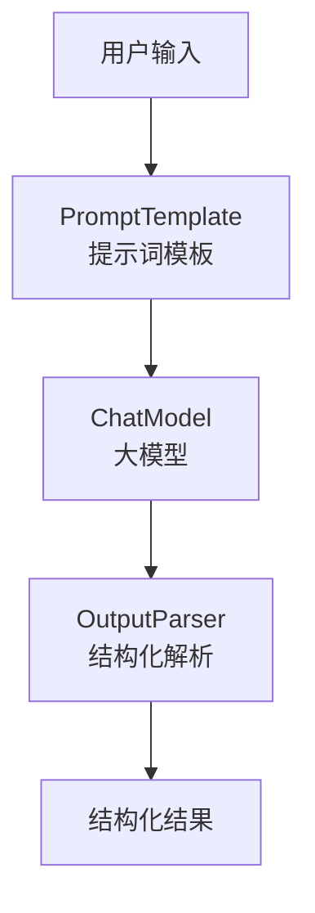

# LangChain 学习
## LangChain 概述
LangChain 提供了预构建的智能体架构和模型集成，帮助我们快速上手，无缝地将大语言模型融入智能体和应用中。
如果您希望快速构建智能体和自主应用，我们建议您使用LangChain。当您有更高级的需求，需要结合确定性工作流与智能体工作流、进行深度定制并严格控制延迟时，请使用LangGraph——我们的低级智能体编排框架和运行时。

LangChain代理构建于LangGraph之上，以提供持久执行、流式处理、人机协同、持久化等功能。您无需了解LangGraph，即可轻松使用基本的LangChain代理。

## Langchain 安装
```bash
pip install -q langchain
```

## LangChain 基础智能体实现

```
from langchain.agents import create_agent

def get_weather(city: str) -> str:
    """Get weather for a given city."""
    return f"It's always sunny in {city}!"

agent = create_agent(
    model="claude-sonnet-4-5-20250929",
    tools=[get_weather],
    system_prompt="You are a helpful assistant",
)

# Run the agent
agent.invoke(
    {"messages": [{"role": "user", "content": "what is the weather in sf"}]}
)
```

上面的方式需要本地部署好大模型，或者用 Claude (Anthropic)的API KEY账号， 并设置ANTHROPIC_API_KEY环境变量。因条件原因，上面代码不能运行。

## LangChain 智能体实现（OpenAI）

```
# 1. 导入必要的模块
from langchain_openai import ChatOpenAI
from langchain.agents import create_agent


# 2. 将函数定义为 LangChain 的 Tool
def get_weather(city: str) -> str:
    """Get the current weather in a given city."""
    # 这里是模拟，真实应用中应接入天气API
    return f"The weather in {city} is sunny and 72°F."

# 3. 以 OpenAI 兼容模式初始化聊天模型
# 关键：通过指定 base_url 来兼容不同服务商
llm = ChatOpenAI(
    model="deepseek-chat",  # 替换为豆包的模型名，如 "Doubao-lite-32k"
    openai_api_key="{your key}",  # 替换为你的API密钥
    base_url="https://api.deepseek.com/v1",  # 替换为豆包的API端点
    temperature=0
)

# 4. 定义智能体的系统提示词
system_prompt = "You are a helpful assistant that can provide weather information."

# 5. 创建智能体
agent = create_agent(
    model=llm,
    tools=[get_weather],
    system_prompt=system_prompt
)

# 6. 执行查询
result = agent.invoke(
    {"messages": [{"role": "user", "content": "What is the weather in San Francisco?"}]}
)

print(result)
```

注意： 密钥不要放到代码中，应该从环境变量中获取。 如果用conda管理环境，可以在当前环境下设置环境变量.

```
conda env config vars set OPENAI_API_KEY={your key}
```

设置完成后，必须先停用再重新激活环境，变量才会加载：
```
conda deactivate
conda activate {your env}
```

### 火山引擎Doubao模型接入关键代码

```
llm_doubao = ChatOpenAI(
    model="doubao-1-5-pro-32k-250115",  # 替换为豆包的模型名，如 "Doubao-lite-32k"
    openai_api_key=os.environ["ARK_OPENAI_API_KEY"],  # 替换为你的API密钥
    base_url="https://ark.cn-beijing.volces.com/api/v3",  # 替换为火山引擎的API端点
    temperature=0
)

system_prompt = "You are a helpful assistant that can provide weather information."

agent_doubao = create_agent(
    model=llm_doubao,
    tools=[get_weather],
    system_prompt=system_prompt
)

result_doubao = agent_doubao.invoke(
    {"messages": [{"role": "user", "content": "What is the weather in San Francisco?"}]}
)
print(result_doubao)
```

## 创建一个真实世界的智能体
构建一个实用的天气预报代理，以展示关键的生产概念：

1. 细化系统提示以改善智能体行为
2. 创建可与外部数据集成的工具
3. 模型配置以实现一致的回复
4. 结构化输出以获得可预测的结果
5. 对话记忆用于聊天式交互
6. 创建并运行智能体创建一个功能完备的智能体

### 定义系统提示词
系统提示词定义智能体的角色和行为，保持具体且可操作：
```
SYSTEM_PROMPT = """You are an expert weather forecaster, who speaks in puns.

You have access to two tools:

- get_weather_for_location: use this to get the weather for a specific location
- get_user_location: use this to get the user's location

If a user asks you for the weather, make sure you know the location. If you can tell from the question that they mean wherever they are, use the get_user_location tool to find their location."""
```

### 创建工具
工具可以让模型通过我们定义的函数调用的方式与外部系统交互，工具也可以依赖运行时和智能体记忆。

```
from dataclasses import dataclass
from langchain.tools import tool, ToolRuntime

@tool
def get_weather_for_location(city: str) -> str:
    """Get weather for a given city."""
    return f"It's always sunny in {city}!"

@dataclass
class Context:
    """Custom runtime context schema."""
    user_id: str

@tool
def get_user_location(runtime: ToolRuntime[Context]) -> str:
    """Retrieve user information based on user ID."""
    user_id = runtime.context.user_id
    return "Florida" if user_id == "1" else "SF"
```

* 配置模型

根据下面的代码，配置模型参数，改成自己的参数：

```
from langchain.chat_models import init_chat_model

model = init_chat_model(
    "claude-sonnet-4-5-20250929",
    temperature=0.5,
    timeout=10,
    max_tokens=1000
)
```

* 定义回复格式
我们可以通过定义结构化的回复格式，来确保智能体的回复符合我们的预期。

```
from dataclasses import dataclass

# We use a dataclass here, but Pydantic models are also supported.
@dataclass
class ResponseFormat:
    """Response schema for the agent."""
    # A punny response (always required)
    punny_response: str
    # Any interesting information about the weather if available
    weather_conditions: str | None = None
```

* 添加记忆
为了维护与智能体交互工程中的状态，我们可以添加对话记忆，这样智能体就能记住之前的对话和上下文。

```
from langgraph.checkpoint.memory import InMemorySaver

checkpointer = InMemorySaver()
```

* 创建并运行智能体

将所有组件组装到智能体中，并运行。

```
from langchain.agents.structured_output import ToolStrategy

agent = create_agent(
    model=model,
    system_prompt=SYSTEM_PROMPT,
    tools=[get_user_location, get_weather_for_location],
    context_schema=Context,
    response_format=ToolStrategy(ResponseFormat),
    checkpointer=checkpointer
)

# `thread_id` is a unique identifier for a given conversation.
config = {"configurable": {"thread_id": "1"}}

response = agent.invoke(
    {"messages": [{"role": "user", "content": "what is the weather outside?"}]},
    config=config,
    context=Context(user_id="1")
)

print(response['structured_response'])
# ResponseFormat(
#     punny_response="Florida is still having a 'sun-derful' day! The sunshine is playing 'ray-dio' hits all day long! I'd say it's the perfect weather for some 'solar-bration'! If you were hoping for rain, I'm afraid that idea is all 'washed up' - the forecast remains 'clear-ly' brilliant!",
#     weather_conditions="It's always sunny in Florida!"
# )


# Note that we can continue the conversation using the same `thread_id`.
response = agent.invoke(
    {"messages": [{"role": "user", "content": "thank you!"}]},
    config=config,
    context=Context(user_id="1")
)

print(response['structured_response'])
# ResponseFormat(
#     punny_response="You're 'thund-erfully' welcome! It's always a 'breeze' to help you stay 'current' with the weather. I'm just 'cloud'-ing around waiting to 'shower' you with more forecasts whenever you need them. Have a 'sun-sational' day in the Florida sunshine!",
#     weather_conditions=None
# )
```

## LangChain 中的“链”
链式调用位于LangChain三层核心架构中的中间层——工作流API抽象层。Chain翻译成中文就是“链”，我们将大模型、相关工具等作为组件，链就是负责将这些组件按照某一种逻辑，顺序组合成一个流水线的方式。比如我们要构建一个简单的问答链，就需要把大模型组件和标准输出组件用链串联起来。

### LangChain 链代码实现
1. 简单链

搭建一个简单链，将模型“输出结果”过滤为一个纯字符串格式:

```
from langchain.chat_models import init_chat_model
from langchain_core.output_parsers import StrOutputParser # 导入标准输出组件

model = init_chat_model(
    model="doubao-1-5-pro-32k-250115",
    model_provider="openai",
    base_url="https://ark.cn-beijing.volces.com/api/v3",
    api_key=os.environ["ARK_OPENAI_API_KEY"], #你注册的火山引擎api_key
)

# 搭建链条，把model和字符串输出解析器组件连接在一起
basic_qa_chain = model | StrOutputParser()

# 查看输出结果
question = "你好，请你介绍一下你自己。"
result = basic_qa_chain.invoke(question)

print(result)

```

运行上面的代码，可以看到此时的result不再是包含模型各种调用信息的AIMessage对象，而是纯粹的模型响应的字符串结果。


2. 提示词模板创建链
链流程增加一个提示词模板，可以借助ChatPromptTemplate非常便捷的将一个提示词模板打造为组件，同样以链的形式加入当前流程中

```
import os
from langchain.chat_models import init_chat_model
from langchain_core.prompts import ChatPromptTemplate
from langchain_core.output_parsers import StrOutputParser

model = init_chat_model(
    model="doubao-1-5-pro-32k-250115",
    model_provider="openai",
    base_url="https://ark.cn-beijing.volces.com/api/v3",
    api_key=os.environ["ARK_OPENAI_API_KEY"], #你注册的火山引擎api_key
)

prompt_template = ChatPromptTemplate([
    ("system", "你是一个乐意助人的助手，请根据用户的问题给出回答"),
    ("user", "这是用户的问题： {topic}， 请用 yes 或 no 来回答")
])

# 直接使用模型 + 输出解析器
bool_qa_chain = prompt_template | model | StrOutputParser()
# 测试
question = "请问 1 + 1 是否 大于 2？"
result = bool_qa_chain.invoke({'topic':question})
print(result)

```

借助提示词模板即可实现相应的结构化输出。


3. 结构化解析器

LangChain中一个基础的链一般由如下三部分构成，分别是提示词模板、大模型和结构化解析器。智能体开发人员通过提示词让大模型输出结构化的字符串，然后通过结构化解析器将字符串解析为指定对象。流程为:





LangChain中常用的核心结构化解析器功能如下:


| 解析器名称 | 功能描述 | 类型 |
|-----------|----------|------|
| BooleanOutputParser | 将 LLM 输出解析为布尔值 | 基础类型解析 |
| DatetimeOutputParser | 将 LLM 输出解析为日期时间 | 基础类型解析 |
| EnumOutputParser | 解析输出为预定义枚举值之一 | 基础类型解析 |
| RegexParser | 使用正则表达式解析 LLM 输出 | 模式匹配解析 |
| RegexDictParser | 使用正则表达式将输出解析为字典 | 模式匹配解析 |
| StructuredOutputParser | 将 LLM 输出解析为结构化格式 | 结构化解析 |
| YamlOutputParser | 使用 Pydantic 模型解析 YAML 输出 | 结构化解析 |
| PandasDataFrameOutputParser | 使用 Pandas DataFrame 格式解析输出 | 数据处理解析 |
| CombiningOutputParser | 将多个输出解析器组合为一个 | 组合解析器 |
| OutputFixingParser | 包装解析器并尝试修复解析错误 | 错误处理解析 |
| RetryOutputParser | 包装解析器并尝试修复解析错误 | 错误处理解析 |
| RetryWithErrorOutputParser | 包装解析器并尝试修复解析错误 | 错误处理解析 |
| ResponseSchema | 结构化输出解析器的响应模式 | 辅助类 |

4. 复杂链构造

我们以一个”从美食菜谱名称生成制作步骤，并从中提取核心食材和烹饪时长” 的案例来讲解，这个案例同样包含了“文本生成”和“结构化信息提取”两个环节。

```
import os
from langchain.chat_models import init_chat_model
from langchain_core.prompts import PromptTemplate
# 这个包在所有 0.1+ 版本中都非常稳定
from langchain_core.output_parsers import JsonOutputParser

# 1. 初始化模型
model = init_chat_model(
    model="doubao-1-5-pro-32k-250115",
    model_provider="openai",
    base_url="https://ark.cn-beijing.volces.com/api/v3",
    api_key=os.environ.get("ARK_OPENAI_API_KEY"),
)

# 2. 初始化 JsonOutputParser (不需要定义复杂的 ResponseSchema)
parser = JsonOutputParser()

# 3. 编写链
# 第一步生成文本
gen_prompt = PromptTemplate.from_template("请根据菜名编写一个简短的制作步骤, 包括制作难度与耗时：{dish_name}")
# 第二步提取并强制要求 JSON
extract_prompt = PromptTemplate.from_template(
    "从以下内容中提取信息：食材清单(ingredients)、烹饪时长(time)、难度(difficulty)。\n"
    "必须以 JSON 格式返回。\n"
    "内容：{recipe}"
)

# 4. 组合链
full_chain = (
    {"recipe": gen_prompt | model | (lambda x: x.content)}
    | extract_prompt
    | model
    | parser  # 直接解析 JSON
)

# 执行
try:
    result = full_chain.invoke({"dish_name": "地三鲜"})
    print(result)
except Exception as e:
    print(f"仍然报错: {e}")
```

### 自定义Langchain组件
Langchain 提供了开发者自定义可运行节点的功能.如果我们想在链中设置调试组件该如何编写代码?这就需要用到LangChain的Runnable组件了。 在上述复合链代码中添加:
```
from langchain_core.runnables import RunnableLambda

def debug_print(x):
    print('中间结果：', x)
    return x

debug_node = RunnableLambda(debug_print)

# 组合成一个复合 Chain
full_chain = (
    {"recipe": gen_prompt | debug_node | model | (lambda x: x.content)} | debug_node
    | extract_prompt
    | model | debug_node
    | parser  # 直接解析 JSON
)

# 调用复合链
result = full_chain.invoke({"title": "地三鲜"})
print(result)

```

运行上面的代码可以看到每一步都会有中间结果输出。


RunnableLambda将python函数转换为可运行节点。转化后的节点可以像任何其它Runnable一样组合并与LangChain链无缝集成。（特别注意: RunnableLambda适合非流式输出，如果要流式输出请使用RunnableGenerator python.langchain.com/api_referen…）。

## LCEL简述
代码中|符号被我们广泛使用，Python没有这种语法，为什么这里可以把各个组件串起来。

其实这是LangChain专门为现代大语言模型应用开发的一种全新表达范式，被称为LCEL（LangChain Expression Language） 。它不仅简化了模型交互的编排过程，还增强了组合的灵活性和可维护性。

###  LCEL的定义
LCEL，全称为LangChain Expression Language，是一种专为 LangChain 框架设计的表达语言。它通过一种链式组合的方式，允许开发者使用清晰、声明式的语法来构建语言模型驱动的应用流程。
简单来说，LCEL 是一种“函数式管道风格”的组件组合机制，用于连接各种可执行单元（Runnable）。这些单元包括提示模板、语言模型、输出解析器、工具函数等。

### LCEL的设计目的
LCEL 的设计初衷在于：

*模块化构建*：将模型调用流程拆解为独立、可重用的组件。
*逻辑可视化*：通过语法符号（如管道符 |）呈现出明确的数据流路径。
*统一运行接口*：所有 LCEL 组件都实现了 .invoke()、.stream()、.batch() 等标准方法，便于在同步、异步或批处理环境下调用。
*脱离框架限制*：相比传统的 Chain 类和 Agent 架构，LCEL 更轻量、更具表达力，减少依赖的“黑盒”逻辑。

### LCEL的核心组成
LCEL的核心组成有如下三点:

1. Runnable 接口

LCEL 的一切基础单元都是 Runnable 对象，它是一种统一的可调用接口，支持如下形式：
.invoke(input)：同步调用
.stream(input)：流式生成
.batch(inputs)：批量执行

2. 管道运算符 |
这是 LCEL 最具特色的语法符号。多个 Runnable 对象(也就是我们说的组件)可以通过 | 串联起来，形成清晰的数据处理链。例如：
```
prompt | model | parser
```

表示数据将依次传入提示模板、模型和输出解析器，最终输出结构化结果。

3. PromptTemplate 与 OutputParser
LCEL 强调组件之间的职责明确，Prompt 只负责模板化输入，Parser 只负责格式化输出，Model 只负责推理。

## LangChain记忆存储

### LangChain单轮会话

编写LangChain单轮对话的基本流程如下:

1. 导入相关依赖包并初始化提示词ChatPromptTemplate
2. 调用统一接口init_chat_model初始化大模型组件
3. 使用LCEL语法将大模型组件和输出解析器组件相连接，形成“链”
4. 执行“链”并输出结果

```
from langchain_core.output_parsers import StrOutputParser
from langchain.chat_models import init_chat_model
from langchain.prompts import ChatPromptTemplate
from langchain.chat_models import init_chat_model


chatbot_prompt = ChatPromptTemplate.from_messages([
    ("system", "你叫小智，是人工智能专家。"),
    ("user", "{input}")
])

# 使用模型
model = init_chat_model(
    model="Qwen/Qwen3-8B",
    model_provider="openai",
    base_url="",
    api_key="你注册的api key",
)

# 直接使用模型 + 输出解析器
basic_qa_chain = chatbot_prompt | model | StrOutputParser()

# 测试
question = "你好，请你介绍一下你自己。"
result = basic_qa_chain.invoke(question)
print(result)

```

### LangChain多轮记忆
要把单轮对话修改为多轮对话我们应该怎么做呢？逻辑其实很简单，在LangChain中我们可以通过人工拼接消息队列来为每次模型调用设置多轮对话记忆。需要进行如下步骤：

1. 构建提示词组件ChatPromptTemplate时，通过占位符MessagePlaceholder定义一个消息列表, 关键代码为：
```
prompt = ChatPromptTemplate.from_messages([ 
    SystemMessage(content="你叫小智，是人工智能专家。"),  
    MessagesPlaceholder(variable_name="messages"), 
])
```

2. 在多轮对话中不断的向message列表中追加消息，并将其传递给占位符，大模型组件接收到列表信息后会自动关联历史消息并回复内容, 关键代码为:

```
messages_list.append(HumanMessage(content=user_query)) 

assistant_reply = chain.invoke({"messages": messages_list}) 

print("小智：", assistant_reply)
```

完整的多轮对话代码如下:

```
import os
from langchain_core.messages import AIMessage, HumanMessage, SystemMessage
from langchain_core.prompts import ChatPromptTemplate, MessagesPlaceholder
from langchain.chat_models import init_chat_model
from langchain_core.output_parsers import StrOutputParser

# 使用 硅基流动 模型
model = init_chat_model(
    model="doubao-1-5-pro-32k-250115",
    model_provider="openai",
    base_url="https://ark.cn-beijing.volces.com/api/v3",
    api_key=os.environ.get("ARK_OPENAI_API_KEY"),
)

parser = StrOutputParser()

prompt = ChatPromptTemplate.from_messages([
    SystemMessage(content="你叫小智，是人工智能专家。"),
    MessagesPlaceholder(variable_name="messages"),
])

chain = prompt | model | parser

messages_list = []  # 初始化历史
print("🔹 输入 exit 结束对话")
while True:
    user_query = input("你：")
    if user_query.lower() in {"exit", "quit"}:
        break
    messages_list.append(HumanMessage(content=user_query))
    assistant_reply = chain.invoke({"messages": messages_list})
    print("小智：", assistant_reply)
    messages_list.append(AIMessage(content=assistant_reply))
    messages_list = messages_list[-50:]
```

### 流式打印
LangChain提供了一个stream方法，可以实现流式输出，只需要在调用模型回答时将invoke方法替换为stream即可。stream()是同步方法,使用for循环接受返回的chunk块。如果异步调用，需要使用astream(),然后使用async for异步for循环获取模型输出。

```
#  调用模型
assistant_reply=''
print('小智:', end=' ')
for chunk in chain.stream({"messages": messages_list}):
    assistant_reply+=chunk
    print(chunk, end="", flush=True)
print()

# 追加 AI 回复
messages_list.append(AIMessage(content=assistant_reply))

```
