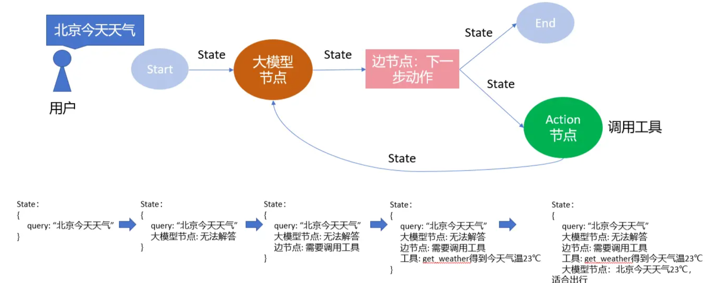
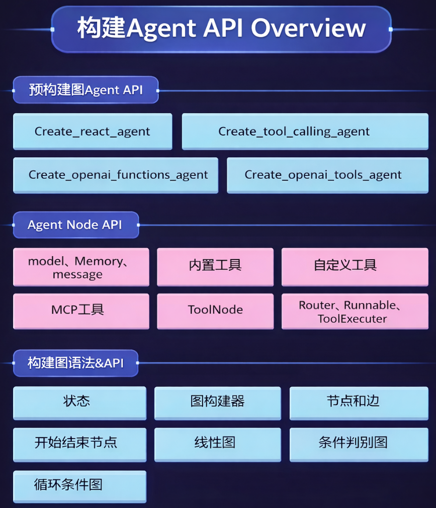

# LangGraph 学习
## LangGraph 介绍
### 什么是LangGraph
LangGraph 是由 LangChain 推出的开源 AI 智能体框架，专门用于构建、部署和管理复杂的生成式 AI 工作流。它的核心价值在于利用**图论（Graph-based）架构**，将大型语言模型（LLM）的任务拆解并重新组织，从而实现更高效、可扩展的逻辑控制。

为了更直观地理解它的运作方式，我们可以借用一个**“航海”**的比喻：

* **超级海图（图架构）：** 这是 LangGraph 提供的基础框架。它不仅是一张静态的纸，而是一套充满了航线、补给点和风险区的复杂坐标系统。
* **领航员（AI 工作流）：** 智能体就像是船上的领航员。它负责在复杂的海洋中实时判断，寻找达成目标的最优路径。
* **制图师（用户/开发者）：** 你就是那位设计一切的制图师。所有的岛屿（任务节点）和航道（逻辑连接）都由你亲手绘制。

简而言之，LangGraph 让开发者能够以“制图师”的身份，预先设定好复杂的逻辑边界，再让“领航员”在这一预设的“超级海图”中精准穿梭。这种模式不仅让 AI 的行为变得可预测、可管理，也为那些喜欢构建精密系统的人提供了一个展示“制图才华”的舞台。

LangGraph 极大地提升了 AI 工作流的透明度，其核心在于对智能体“状态”的精准掌控。你可以将**“状态”**想象成一个智能**记忆库**或数字笔记本，它能实时记录并更新数据在工作流各阶段的演变过程。

为了更具象地理解，我们可以参考以下要点：

* **数据追踪的观测性：** 以天气监测智能体为例，系统能自动记录降雪频次，并依据历史趋势给出建议。这种可视化过程让初学者也能清晰掌握状态管理的逻辑。
* **高效调试与性能优化：** 由于状态管理将应用进程集中化，开发者可以快速定位问题，缩短调试周期，从而显著提升决策效率、系统可扩展性及整体运行性能。
* **技术基石与多功能性：** LangGraph 深度集成了 **LangChain** 框架及其丰富的 LLM 库，并引入了**“人机回圈”**（Human-in-the-loop）机制。

通过整合一系列 API 与开发工具，LangGraph 为构建聊天机器人、复杂状态图及各类智能体系统提供了一个全方位、多用途的平台。这种清晰的底层逻辑，不仅降低了新手入行的门槛，也让资深开发者对幕后运作一目了然。


### LangGraph与LangChain的关系与区别
简单来说，**LangChain** 是构建 AI 应用的“工具箱”，而 **LangGraph** 则是为了解决“复杂循环逻辑”而专门设计的“指挥中心”。

以下是它们的关系与核心区别：

1. 核心定位与关系

* **包含关系**：LangGraph 是基于 LangChain 构建的扩展库。它利用了 LangChain 的核心组件（如提示词模板、模型接口、工具调用），但专门用于管理智能体的**状态**和**执行顺序**。
* **协作模式**：LangChain 提供了基础组件（如 LLM 对象），而 LangGraph 将这些组件排列在“超级地图”般的图架构中，负责统筹它们如何交互。

2. 主要区别对照表

| 特性 | LangChain (Chain 模式) | LangGraph (Graph 模式) |
| --- | --- | --- |
| **逻辑流向** | **线性或有向无环图 (DAG)**。任务通常按 1→2→3 顺序执行，不鼓励回退。 | **循环图**。支持智能体在任务间往返、重试或根据结果修正路径。 |
| **状态管理** | 状态传递较为隐式，通常是简单的输入/输出流。 | **完全透明的状态库**。像数字笔记本一样记录、跟踪和更新每个阶段的信息。 |
| **复杂度** | 适合构建简单的任务链，逻辑固定。 | 适合构建复杂的“智能体工作流”，如需要多步决策和自我纠错的任务。 |
| **可观测性** | 调试长链条时较为困难。 | **高可观测性**。通过集中的状态管理，开发者能清楚看到每一幕后的运作，缩短调试周期。 |

3. 为什么需要 LangGraph？

在传统的 LangChain 链式结构中，如果你想让 AI 在发现错误时“返回上一步重新执行”，实现起来非常臃肿。

LangGraph 通过引入**“状态图”**解决了这个问题：

* **状态透明度**：它能记录 AI 监控任务（如天气趋势）时的所有中间变量。
* **人机回圈 (Human-in-the-loop)**：它允许在工作流中加入人工审核环节，这在 LangChain 的纯自动流中很难优雅实现。
* **可扩展性**：对于新手，它提供了更清晰的架构视图；对于专家，它通过 API 和工具集提供了更强大的定制能力。

## LangGraph 创建天气助手智能体
### LangGraph 环境搭建
使用anaconda管理虚拟环境, 并添加环境变量:
```
conda create -n langgraph python=3.11
conda activate langgraph
```
安装LangGraph依赖
```
pip install langchain langgraph
```
设置环境变量

```
conda env config vars set OPENAI_API_KEY={your key}
```

设置完成后，必须先停用再重新激活环境，变量才会加载：
```
conda deactivate
conda activate {your env}
```

### LangGraph预构建智能体API
使用LangGraph最高层的预构建图API可以快速构建智能体， 下面简单列举几个LangGraph预构建图模板的API:
* **create_react_agent**:  最常用最通用的图模板，允许当前大语言模型自动对传入的所有工具进行编排，思考当前任务需要使用哪些工具，并实时接收工具返回的结果灵活思考下一步计划，直到完成任务。
* **create_tool_calling_agent**: 该图模板适用于对单独的工具进行性能调试。
* **create_openai_functions_agent**和**create_openai_tools_agent**: 该图模板用于构建以OpenAI风格请求工具函数的智能体(并不是只兼容OpenAI的GPT模型）

### 天气助手案例实战

1. 首先创建获取天气的工具函数
请求心知天气API获得天气信息， 具体接入方式请参考[心知天气API文档](https://www.seniverse.com/doc)。 使用pydantic库定义一个对象类型描述传入参数，这里表示要传入的是一个字符串loc参数，表示的含义是城市名称。定义的WeatherQuery对象在@tool(args_schema=WeatherQuery)中约束get_weather的函数参数。

```
import requests
from langchain_core.tools import tool
from pydantic import BaseModel, Field

class WeatherQuery(BaseModel):
    loc: str = Field(description="城市名称")

@tool(args_schema=WeatherQuery)
def get_weather(loc):
    """
        查询即时天气函数
        :param loc: 必要参数，字符串类型，用于表示查询天气的具体城市名称，
        :return：心知天气, 返回结果对象类型为解析之后的JSON格式对象，并用字符串形式进行表示，其中包含了全部重要的天气信息
    """
    url = "https://api.seniverse.com/v3/weather/now.json"
    params = {
        "key": "{你的心知天气私钥}",
        "location": loc,
        "language": "zh-Hans",
        "unit": "c",
    }
    response = requests.get(url, params=params)
    temperature = response.json()
    return temperature['results'][0]['now']
```

2. 初始化大模型和函数列表，该部分代码与LangChain的相关代码完全一致

```
model = init_chat_model(
    model="doubao-1-5-pro-32k-250115",
    model_provider="openai",
    base_url="https://ark.cn-beijing.volces.com/api/v3",
    api_key=os.environ.get("ARK_OPENAI_API_KEY"),
)
```

3. 创建ReACT预制图结构并构建智能体，通过invoke方法传入messages列表得到智能体输出结果
```
agent = create_react_agent(
    model=model,
    tools=[get_weather],
    verbose=True,
)
res = agent.invoke(
    {
        "messages": [
            ("user", "北京今天天气")
        ]
    }
)
print(res)

```
输出结果如下：

```
智能体输出结果：
{'messages': [HumanMessage(content='你好，请介绍一下你自己，并告诉我北京的天气。', additional_kwargs={}, response_metadata={}, id='99e130cf-3492-4e73-944c-2c046ee9a138'), AIMessage(content='我是豆包，拥有丰富的知识，可以帮你解答各种问题。', additional_kwargs={'refusal': None}, response_metadata={'token_usage': {'completion_tokens': 41, 'prompt_tokens': 124, 'total_tokens': 165, 'completion_tokens_details': {'accepted_prediction_tokens': None, 'audio_tokens': None, 'reasoning_tokens': 0, 'rejected_prediction_tokens': None}, 'prompt_tokens_details': {'audio_tokens': None, 'cached_tokens': 0}}, 'model_provider': 'openai', 'model_name': 'doubao-1-5-pro-32k-250115', 'system_fingerprint': None, 'id': '021767320263841546c150dd91466c4968e4bb2bdb9d5d2815aa1', 'service_tier': 'default', 'finish_reason': 'tool_calls', 'logprobs': None}, id='lc_run--019b7c7f-1c09-7573-b83d-2f70522f8c72-0', tool_calls=[{'name': 'get_weather', 'args': {'loc': '北京'}, 'id': 'call_0ucg5p7l1ebcsf7azvgqjn83', 'type': 'tool_call'}], usage_metadata={'input_tokens': 124, 'output_tokens': 41, 'total_tokens': 165, 'input_token_details': {'cache_read': 0}, 'output_token_details': {'reasoning': 0}}), ToolMessage(content='{"text": "晴", "code": "0", "temperature": "-2"}', name='get_weather', id='a70dac95-eb27-42cd-a235-d114aba26f18', tool_call_id='call_0ucg5p7l1ebcsf7azvgqjn83'), AIMessage(content='我已为你查询到北京当前的天气状况。天气为晴，天气代码是0，当前温度为 -2℃。 ', additional_kwargs={'refusal': None}, response_metadata={'token_usage': {'completion_tokens': 29, 'prompt_tokens': 203, 'total_tokens': 232, 'completion_tokens_details': {'accepted_prediction_tokens': None, 'audio_tokens': None, 'reasoning_tokens': 0, 'rejected_prediction_tokens': None}, 'prompt_tokens_details': {'audio_tokens': None, 'cached_tokens': 0}}, 'model_provider': 'openai', 'model_name': 'doubao-1-5-pro-32k-250115', 'system_fingerprint': None, 'id': '021767320266745546c150dd91466c4968e4bb2bdb9d5d22f96bd', 'service_tier': 'default', 'finish_reason': 'stop', 'logprobs': None}, id='lc_run--019b7c7f-27d6-7c23-824a-e6818beaebc2-0', usage_metadata={'input_tokens': 203, 'output_tokens': 29, 'total_tokens': 232, 'input_token_details': {'cache_read': 0}, 'output_token_details': {'reasoning': 0}})]}
```

### ReACT图结构浅析

上面的代码中，我们创建了一个ReACT预制图结构的智能体，该智能体在调用时会根据传入的messages列表自动进行思考和决策，最终返回一个包含所有思考过程和最终结果的messages列表。LangGraph框架是通过Nodes（点）和Edges(边）的组合去创建复杂的循环工作流程，通过消息传递的方式串联所有节点形成一个通路。为了维持消息能够及时的更新并能够在节点中反复传递，LangGraph构建了 State状态 概念。每启动一个LangGraph构建流都会生成一个状态，图中的节点在处理时会传递和修改该状态。整个状态不仅仅是一组静态数据，更是根据每个节点的输出动态更新的，然后影响循环内的后续操作。

具体结构图如下：



ReACT图具体流程如下:

* **开始**： 接收用户的输入
* **调用模型**： 将当前状态传递给大模型要求模型思考
* **模型决策**： 大模型会以特定格式返回一个响应，这个响应可能是：
  * **最终答案**： 如果模型认为信息足够，就直接回答用户
  * **工具调用**： 如果模型认为需要更多信息，它会决定调用哪个工具
* **执行工具**： 如果模型决定调用工具，图就会执行该工具，并获取工具返回的结果
* **更新状态**： 将工具的执行结果添加到状态中
* **循环**： 带着新的信息回到第2步，让模型再次思考
* **结束**： 当模型返回最终答案时，循环结束，图运行完成将结果返回给用户。


## LangGraph 多工具调用
我们基于前面的天气查询智能体，添加2个新的工具：
1. 一个工具用于查询当前时间
2. 一个工具用于查询城市基础信息

这样智能体有3个工具，让大模型去规划怎么调用这些工具，以回答用户的问题。

```python
# ========= 工具 1：天气查询 =========
class WeatherQuery(BaseModel):
    loc: str = Field(description="城市名称")


@tool(args_schema=WeatherQuery)
def get_weather(loc: str) -> Dict:
    """查询城市实时天气"""
    url = "https://api.seniverse.com/v3/weather/now.json"
    params = {
        "key": os.environ.get("XINZHI_API_KEY"),
        "location": loc,
        "language": "zh-Hans",
        "unit": "c",
    }
    response = requests.get(url, params=params, timeout=10)
    data = response.json()
    return data["results"][0]["now"]


# ========= 工具 2：当前时间 =========
@tool
def get_time() -> str:
    """获取当前系统时间"""
    return datetime.now().strftime("%Y-%m-%d %H:%M:%S")


# ========= 工具 3：城市基础信息（示例工具） =========
class CityInfoQuery(BaseModel):
    city: str = Field(description="城市名称")


@tool(args_schema=CityInfoQuery)
def get_city_info(city: str) -> Dict:
    """获取城市的基础介绍信息（示例）"""
    mock_db = {
        "北京": {
            "country": "中国",
            "role": "首都",
            "population": "约 2180 万",
            "feature": "政治、文化、国际交往中心",
        }
    }
    return mock_db.get(city, {"info": "暂无该城市信息"})
```

这个例子中 LangGraph 的能力体现在：
1. 多工具调用（Multi-tool）
模型会在一次任务中调用：get_weather("北京")， get_time()，get_city_info("北京")。不需要写 if / else 或调用顺序逻辑。
2. 自主规划（ReAct）
LangGraph 内部执行的是：
```
Thought: 用户要天气、时间、城市信息
Action: get_weather
Action: get_time
Action: get_city_info
Observation: ...
Thought: 汇总信息，生成自然语言回复
```
规划逻辑完全由模型完成, 这正是 LangGraph > 传统 LangChain Chain 的核心差异。
3. 并行调用（Parallel）
* get_time
* get_city_info
* get_weather

三者互不依赖, LangGraph 会在同一个 graph step 中并行执行（不是你 Python 写并发，而是 执行图层面的并行）。

主体逻辑代码如下：
```python
def main():
    # ========= 初始化大模型 =========
    model = init_chat_model(
        model="doubao-1-5-pro-32k-250115",
        model_provider="openai",
        base_url="https://ark.cn-beijing.volces.com/api/v3",
        api_key=os.environ.get("ARK_OPENAI_API_KEY"),
        temperature=0.2,
    )

    # ========= 创建 LangGraph ReAct 智能体 =========
    agent = create_react_agent(
        model=model,
        tools=[
            get_weather,
            get_time,
            get_city_info,
        ],
    )

    # ========= 触发多工具 + 自主规划 =========
    result = agent.invoke(
        {
            "messages": [
                (
                    "user",
                    "你好，请介绍一下你自己，并告诉我北京现在的天气、当前时间，以及北京的基本情况。"
                )
            ]
        }
    )
    print(result)
    print("====== 智能体最终输出 ======")
    print(result["messages"][-1].content)
```

运行结果如下：
```
{'messages': [HumanMessage(content='你好，请介绍一下你自己，并告诉我北京现在的天气、当前时间，以及北京的基本情况。', additional_kwargs={}, response_metadata={}, id='3dccf11c-c7f6-4a74-a652-5861ac60ca29'), AIMessage(content='用户需要了解北京天气、当前时间和北京基本情况，调用 get_weather 函数获取北京天气，调用 get_time 函数获取当前时间，调用 get_city_info 函数获取北京基本情况。', additional_kwargs={'refusal': None}, response_metadata={'token_usage': {'completion_tokens': 144, 'prompt_tokens': 148, 'total_tokens': 292, 'completion_tokens_details': {'accepted_prediction_tokens': None, 'audio_tokens': None, 'reasoning_tokens': 0, 'rejected_prediction_tokens': None}, 'prompt_tokens_details': {'audio_tokens': None, 'cached_tokens': 0}}, 'model_provider': 'openai', 'model_name': 'doubao-1-5-pro-32k-250115', 'system_fingerprint': None, 'id': '021767329930747e70bd5cd8ac63a2aabaf92639e3ab2c339748e', 'service_tier': 'default', 'finish_reason': 'tool_calls', 'logprobs': None}, id='lc_run--019b7d12-9d6c-72d0-99aa-925e75c90e69-0', tool_calls=[{'name': 'get_weather', 'args': {'loc': '北京'}, 'id': 'call_9m94bbk82tpxxfx6bgsy6v2g', 'type': 'tool_call'}, {'name': 'get_time', 'args': {}, 'id': 'call_v44yndijzynj75g2ys1wzjsz', 'type': 'tool_call'}, {'name': 'get_city_info', 'args': {'city': '北京'}, 'id': 'call_9ish4jrz4d2x1dcik1c069hz', 'type': 'tool_call'}], usage_metadata={'input_tokens': 148, 'output_tokens': 144, 'total_tokens': 292, 'input_token_details': {'cache_read': 0}, 'output_token_details': {'reasoning': 0}}), ToolMessage(content='{"text": "晴", "code": "0", "temperature": "2"}', name='get_weather', id='f2ba5d7f-1a39-4584-a573-fa26eafc3174', tool_call_id='call_9m94bbk82tpxxfx6bgsy6v2g'), ToolMessage(content='2026-01-02 12:58:54', name='get_time', id='7ae308cf-bc3c-474d-8576-43c4c647dfff', tool_call_id='call_v44yndijzynj75g2ys1wzjsz'), ToolMessage(content='{"country": "中国", "role": "首都", "population": "约 2180 万", "feature": "政治、文化、国际交往中心"}', name='get_city_info', id='5067a7c9-7bf5-4781-adb8-00f7a90830b0', tool_call_id='call_9ish4jrz4d2x1dcik1c069hz'), AIMessage(content='你好，我是豆包，能为你提供各种信息和帮助。北京当前的天气是晴，气温为 2℃。现在的时间是 2026 年 01 月 02 日 12 时 58 分 54 秒。北京是中国的首都，是中国的政治、文化和国际交往中心，人口约 2180 万。 ', additional_kwargs={'refusal': None}, response_metadata={'token_usage': {'completion_tokens': 95, 'prompt_tokens': 372, 'total_tokens': 467, 'completion_tokens_details': {'accepted_prediction_tokens': None, 'audio_tokens': None, 'reasoning_tokens': 0, 'rejected_prediction_tokens': None}, 'prompt_tokens_details': {'audio_tokens': None, 'cached_tokens': 0}}, 'model_provider': 'openai', 'model_name': 'doubao-1-5-pro-32k-250115', 'system_fingerprint': None, 'id': '021767329935141e70bd5cd8ac63a2aabaf92639e3ab2c3ed35f8', 'service_tier': 'default', 'finish_reason': 'stop', 'logprobs': None}, id='lc_run--019b7d12-af02-7292-889d-71675e4c6c38-0', usage_metadata={'input_tokens': 372, 'output_tokens': 95, 'total_tokens': 467, 'input_token_details': {'cache_read': 0}, 'output_token_details': {'reasoning': 0}})]}
====== 智能体最终输出 ======
你好，我是豆包，能为你提供各种信息和帮助。北京当前的天气是晴，气温为 2℃。现在的时间是 2026 年 01 月 02 日 12 时 58 分 54 秒。北京是中国的首都，是中国的政治、文化和国际交往中心，人口约 2180 万。
```

可以看到，LangGraph 自动规划了调用顺序，并行调用了 3 个工具，最后汇总了信息，生成了自然语言回复。
在工具调用规划中，规划了3个工具调用，具体内容为：
```
 tool_calls=[{'name': 'get_weather', 'args': {'loc': '北京'}, 'id': 'call_9m94bbk82tpxxfx6bgsy6v2g', 'type': 'tool_call'}, {'name': 'get_time', 'args': {}, 'id': 'call_v44yndijzynj75g2ys1wzjsz', 'type': 'tool_call'}, {'name': 'get_city_info', 'args': {'city': '北京'}, 'id': 'call_9ish4jrz4d2x1dcik1c069hz', 'type': 'tool_call'}]
```

我们将用户的问题改成：
```
你好，请分别告诉我北京、上海现在的天气，当前时间，以及城市的基本情况。
```

智能体的输出为：
```
{
  "messages": [
    {
      "role": "user",
      "content": "你好，请分别告诉我北京、上海现在的天气，当前时间，以及城市的基本情况。",
      "id": "cedbbc7d-b3dd-4a18-b153-ef1ea8a34488"
    },
    {
      "role": "assistant",
      "content": "用户需要北京、上海的当前天气、当前时间和城市基本情况，调用get_weather函数查询北京和上海的天气，调用get_time函数获取当前时间，调用get_city_info函数获取北京和上海的城市基本情况。",
      "tool_calls": [
        {
          "name": "get_weather",
          "args": {
            "loc": "北京"
          },
          "id": "call_lqcra92f4ontffi0mm4zogw8"
        }
      ],
      "id": "lc_run--019b7d36-998e-7671-bf25-03d674c8a7be-0"
    },
    {
      "role": "tool",
      "content": "{\"text\": \"晴\", \"code\": \"0\", \"temperature\": \"3\"}",
      "name": "get_weather",
      "tool_call_id": "call_lqcra92f4ontffi0mm4zogw8",
      "id": "3ee46fc8-1833-45fd-89f7-6c653988e7d4"
    },
    {
      "role": "assistant",
      "content": "",
      "tool_calls": [
        {
          "name": "get_weather",
          "args": {
            "loc": "上海"
          },
          "id": "call_ixb68hjpvhkno3s2y48ayp7a"
        }
      ],
      "id": "lc_run--019b7d36-a400-71e3-8611-d9a9c19b8048-0"
    },
    {
      "role": "tool",
      "content": "{\"text\": \"多云\", \"code\": \"4\", \"temperature\": \"3\"}",
      "name": "get_weather",
      "tool_call_id": "call_ixb68hjpvhkno3s2y48ayp7a",
      "id": "3054eed3-7739-4fb8-98a7-f31cc87b376f"
    },
    {
      "role": "assistant",
      "content": "",
      "tool_calls": [
        {
          "name": "get_city_info",
          "args": {
            "city": "北京"
          },
          "id": "call_bvtgfla71y2coae1ygtgizls"
        },
        {
          "name": "get_city_info",
          "args": {
            "city": "上海"
          },
          "id": "call_cbtm2jy963po5l0tpn0fsply"
        }
      ],
      "id": "lc_run--019b7d36-acb1-75b2-a492-2b2368974832-0"
    },
    {
      "role": "tool",
      "content": "{\"country\": \"中国\", \"role\": \"首都\", \"population\": \"约 2180 万\", \"feature\": \"政治、文化、国际交往中心\"}",
      "name": "get_city_info",
      "tool_call_id": "call_bvtgfla71y2coae1ygtgizls",
      "id": "f6586df8-c034-4c47-9a9a-e820b0719bfd"
    },
    {
      "role": "tool",
      "content": "{\"country\": \"中国\", \"role\": \"经济、国际交往中心\", \"population\": \"约 2480 万\", \"feature\": \"经济、国际交往中心\"}",
      "name": "get_city_info",
      "tool_call_id": "call_cbtm2jy963po5l0tpn0fsply",
      "id": "41ad7f1d-924c-4a86-92d2-478be12cd951"
    },
    {
      "role": "assistant",
      "content": "",
      "tool_calls": [
        {
          "name": "get_time",
          "args": {},
          "id": "call_g28r2002y5altklnb61oflsb"
        }
      ],
      "id": "lc_run--019b7d36-b4f0-7de3-a558-5d201a24f062-0"
    },
    {
      "role": "tool",
      "content": "2026-01-02 13:38:17",
      "name": "get_time",
      "tool_call_id": "call_g28r2002y5altklnb61oflsb",
      "id": "6eeceda1-5d80-4ac0-8b76-aaecad8f0821"
    },
    {
      "role": "assistant",
      "content": "当前时间是2026年1月2日13点38分17秒。北京目前的天气是晴，温度为3℃；上海目前的天气是多云，温度为3℃。\n\n北京是中国的首都，人口约2180万，是中国的政治、文化、国际交往中心。上海是中国的经济、国际交往中心，人口约2480万。",
      "id": "lc_run--019b7d36-b96e-7da2-9579-617b193722f0-0"
    }
  ]
}
```

可以看到，LangGraph 自动规划了调用顺序，并行调用了 3 个工具，最后汇总了信息，生成了自然语言回复。

## 深入理解LangGraph底层API
### 为何需要掌握LangGraph底层API
在AI智能体开发领域，LangGraph作为LangChain生态的重要成员，为开发者提供了构建复杂工作流的强大工具。虽然LangGraph提供了便捷的预构建API如`create_react_agent`，但在许多高级场景中，掌握底层API是必不可少的。

LangGraph的架构可分为三层：
- **预构建图API层**：提供开箱即用的Agent模板，适合快速开发
- **AgentNode API层**：允许自定义节点并集成到预定义图结构中
- **底层API层**：提供完全灵活的图构建能力，适用于复杂场景如人机协作、多Agent系统等

架构图如下：


### LangGraph核心概念解析

在深入代码前，我们需要理解LangGraph的三个核心概念：
1. 节点（Nodes）
节点是图中的基本处理单元，可以是：
- 大语言模型调用
- 工具函数
- 数据处理步骤
- 甚至是另一个Agent
每个节点接收状态作为输入，处理后返回更新后的状态。
2. 边（Edges）
边定义了节点间的连接关系，控制执行流程：
- 普通边：顺序执行
- 条件边：基于状态值决定下一个节点
- 循环边：实现迭代处理
3. 状态（State）
状态是贯穿整个工作流的数据容器，它：
- 在节点间传递数据
- 保持工作流上下文
- 被每个节点动态更新
- 决定条件分支走向

这三者共同构成了LangGraph有向有环图(DAG)的基础，使复杂工作流的构建成为可能。

### 用底层API构建一个LangGraph应用

让我们从一个简单但完整的示例开始，创建一个执行加减法操作的工作流。
#### 项目环境准备

首先，确保安装必要依赖：

```bash
pip install langgraph pydantic grandalf
```
`grandalf`库用于生成图结构的可视化表示，对调试非常有帮助。

#### 基础State和图结构创建
我们先不使用类型约束，直接使用字典作为状态：
```python
from langgraph.graph import StateGraph, START, END
# 创建StateGraph实例，使用字典作为状态类型
builder = StateGraph(dict)
```

#### 定义节点函数

接下来定义两个简单的节点函数，一个执行加法，一个执行减法：

```python
def addition(state):
    """加法节点：将状态中的x值加1"""
    print(f'[加法节点] 接收到状态: {state}')
    # 返回更新后的状态
    return {"x": state["x"] + 1}

def subtraction(state):
    """减法节点：将状态中的x值减2"""
    print(f'[减法节点] 接收到状态: {state}')
    # 返回更新后的状态
    return {"x": state["x"] - 2}
```

#### 构建工作流图

现在，我们将这些元素组合成一个完整的工作流：

```python
# 添加节点到图中
builder.add_node("addition", addition)
builder.add_node("subtraction", subtraction)

# 定义节点间的连接关系
builder.add_edge(START, "addition")        # 从开始到加法节点
builder.add_edge("addition", "subtraction") # 从加法节点到减法节点
builder.add_edge("subtraction", END)      # 从减法节点到结束
```

上述代码定义了一个线性工作流：START → addition → subtraction → END

#### 编译与可视化图结构

编译图并生成可视化表示：

```python
# 编译图
graph = builder.compile()

# 生成ASCII可视化
graph.get_graph().print_ascii()
```

执行上述代码将输出类似以下的ASCII图：

```
+-----------+     +-----------+     +--------------+     +---------+
| __start__ | --> | addition  | --> | subtraction  | --> | __end__ |
+-----------+     +-----------+     +--------------+     +---------+
```

这个可视化清晰展示了工作流的执行顺序，对理解和调试复杂图结构非常有帮助。

#### 运行图工作流

最后，我们提供初始状态并运行工作流：

```python
# 设置初始状态
initial_state = {"x": 10}

# 执行图
result = graph.invoke(initial_state)

print(f'[最终结果] {result}')
```

执行后，控制台将显示：

```
[加法节点] 接收到状态: {'x': 10}
[减法节点] 接收到状态: {'x': 11}
[最终结果] {'x': 9}
```

我们可以看到状态如何从初始值10，经过加法节点变为11，再经过减法节点变为9的完整过程。

#### 增强健壮性：使用Pydantic进行状态管理

上一节的示例虽然简单，但存在一个严重问题：状态类型没有约束，容易导致运行时错误。让我们使用Pydantic改进这个设计。

1. Pydantic基础

Pydantic是一个数据验证和设置管理库，使用Python类型提示。它能自动验证数据类型，提供默认值，并生成清晰的错误信息。

基础用法示例：

```python
from pydantic import BaseModel

class Person(BaseModel):
    name: str
    age: int
    email: str = "default@example.com"  # 有默认值的字段

# 创建实例
person = Person(name="张三", age=30)
print(person)  # name='张三' age=30 email='default@example.com'

# 类型验证会自动进行
try:
    Person(name=123, age="thirty")  # 会抛出验证错误
except Exception as e:
    print(f"验证错误: {e}")
```

2. 重构加减法工作流

现在，让我们用Pydantic重构前面的加减法示例：

```python
from pydantic import BaseModel
from langgraph.graph import StateGraph, START, END

# 1. 定义结构化状态模型
class CalcState(BaseModel):
    x: int  # 必须是整数

# 2. 重新定义节点函数，使用类型提示
def addition(state: CalcState) -> CalcState:
    print(f'[加法节点] 接收到状态: {state}')
    # 使用CalcState构造函数返回新状态
    return CalcState(x=state.x + 1)

def subtraction(state: CalcState) -> CalcState:
    print(f'[减法节点] 接收到状态: {state}')
    return CalcState(x=state.x - 2)

# 3. 构建图
builder = StateGraph(CalcState)
builder.add_node("addition", addition)
builder.add_node("subtraction", subtraction)
builder.add_edge(START, "addition")
builder.add_edge("addition", "subtraction")
builder.add_edge("subtraction", END)

# 4. 编译图
graph = builder.compile()

# 5. 执行图
initial_state = CalcState(x=10)
result = graph.invoke(initial_state)

print(f'[最终结果] {result}')
```

改进后的版本具备以下优势：
- 状态字段类型明确，避免运行时错误
- IDE提供更好的自动补全和类型提示
- 函数签名清晰表明输入输出类型
- 错误提前暴露而非运行时才发现

### 进阶案例：构建条件判断工作流

理解了基本概念后，让我们构建一个更复杂的案例，展示条件边的使用。

1. 业务场景

假设我们正在构建一个客户服务工作流：
- 如果客户是VIP，直接转接给高级客服
- 如果是普通客户且问题简单，使用AI助手自动回复
- 如果是普通客户但问题复杂，转接给普通客服

2. 代码实现

```python
from typing import Literal, TypedDict
from pydantic import BaseModel
from langgraph.graph import StateGraph, START, END

# 1. 定义状态模型
class CustomerServiceState(BaseModel):
    customer_type: Literal["VIP", "regular"]  # 客户类型
    issue_complexity: Literal["simple", "complex"]  # 问题复杂度
    response: str = ""  # 响应内容
    assigned_agent: str = ""  # 分配的客服

# 2. 定义节点函数
def analyze_customer(state: CustomerServiceState) -> CustomerServiceState:
    print(f"[客户分析] 客户类型: {state.customer_type}, 问题复杂度: {state.issue_complexity}")
    return state  # 此节点只做分析，不修改状态

def route_request(state: CustomerServiceState) -> str:
    """条件路由函数，决定下一步流向哪个节点"""
    if state.customer_type == "VIP":
        return "senior_agent"
    elif state.issue_complexity == "simple":
        return "ai_assistant"
    else:
        return "regular_agent"

def senior_agent(state: CustomerServiceState) -> CustomerServiceState:
    print("[高级客服] 处理VIP客户请求")
    return CustomerServiceState(
        customer_type=state.customer_type,
        issue_complexity=state.issue_complexity,
        response="您的请求已由高级客服处理，我们会尽快解决。",
        assigned_agent="senior_agent"
    )

def regular_agent(state: CustomerServiceState) -> CustomerServiceState:
    print("[普通客服] 处理复杂问题")
    return CustomerServiceState(
        customer_type=state.customer_type,
        issue_complexity=state.issue_complexity,
        response="您的问题已分配给专业客服，将在24小时内回复。",
        assigned_agent="regular_agent"
    )

def ai_assistant(state: CustomerServiceState) -> CustomerServiceState:
    print("[AI助手] 自动回复简单问题")
    return CustomerServiceState(
        customer_type=state.customer_type,
        issue_complexity=state.issue_complexity,
        response="根据我们的知识库，您的问题可以通过以下步骤解决：...",
        assigned_agent="ai_assistant"
    )

# 3. 构建图
builder = StateGraph(CustomerServiceState)

# 添加节点
builder.add_node("analyze", analyze_customer)
builder.add_node("senior_agent", senior_agent)
builder.add_node("regular_agent", regular_agent)
builder.add_node("ai_assistant", ai_assistant)

# 设置入口
builder.add_edge(START, "analyze")

# 添加条件边
builder.add_conditional_edges(
    "analyze",
    route_request,  # 路由函数
    {
        "senior_agent": "senior_agent",
        "regular_agent": "regular_agent",
        "ai_assistant": "ai_assistant"
    }
)

# 所有路径都指向结束
builder.add_edge("senior_agent", END)
builder.add_edge("regular_agent", END)
builder.add_edge("ai_assistant", END)

# 4. 编译图
graph = builder.compile()

# 5. 可视化
graph.get_graph().print_ascii()

# 6. 测试不同场景
print("\n===== 测试案例 1: VIP客户 =====")
result1 = graph.invoke(CustomerServiceState(customer_type="VIP", issue_complexity="complex"))
print(f"结果: {result1}")

print("\n===== 测试案例 2: 普通客户 + 简单问题 =====")
result2 = graph.invoke(CustomerServiceState(customer_type="regular", issue_complexity="simple"))
print(f"结果: {result2}")

print("\n===== 测试案例 3: 普通客户 + 复杂问题 =====")
result3 = graph.invoke(CustomerServiceState(customer_type="regular", issue_complexity="complex"))
print(f"结果: {result3}")
```

#### 工作流架构图

执行`graph.get_graph().print_ascii()`将生成如下架构图：

```
+-----------+     +-----------+     +---------------+
| __start__ | --> |  analyze  | --> | senior_agent  | --> +---------+
+-----------+     +-----------+     +---------------+     | __end__ |
                      |                                   +---------+
                      |--> +---------------+     +-------+
                      |    | regular_agent | --> |
                      |    +---------------+     |
                      |                          |
                      |--> +---------------+     |
                           | ai_assistant  | --> |
                           +---------------+     |
```

这个条件工作流展示了LangGraph底层API的核心优势：能够根据运行时状态动态决定执行路径，构建复杂的决策树。

#### 总结与最佳实践

通过本教程，我们系统地学习了LangGraph底层API的核心概念和使用方法：

1. **理解核心概念**：节点、边、状态三者构成了LangGraph的基础架构
2. **状态管理**：使用Pydantic定义结构化状态，大幅提升代码健壮性和可维护性
3. **工作流构建**：从简单线性工作流到条件判断工作流，逐步掌握复杂场景构建方法
4. **可视化调试**：利用`print_ascii()`方法生成工作流可视化，辅助开发和调试

#### 最佳实践建议：

- **状态设计**：保持状态简洁，只包含工作流必需的数据
- **节点职责**：每个节点应有单一明确职责，避免大而全的节点函数
- **错误处理**：在节点函数中增加适当的错误处理逻辑
- **类型约束**：始终使用Pydantic或TypedDict约束状态类型，避免运行时错误
- **可测试性**：节点函数应独立于图结构，便于单元测试

LangGraph底层API提供了构建复杂AI工作流的强大能力，虽然学习曲线较陡，但掌握它将使你能够应对各种高级应用场景。

### 打造一个深度研究智能体
https://towardsdatascience.com/langgraph-101-lets-build-a-deep-research-agent/